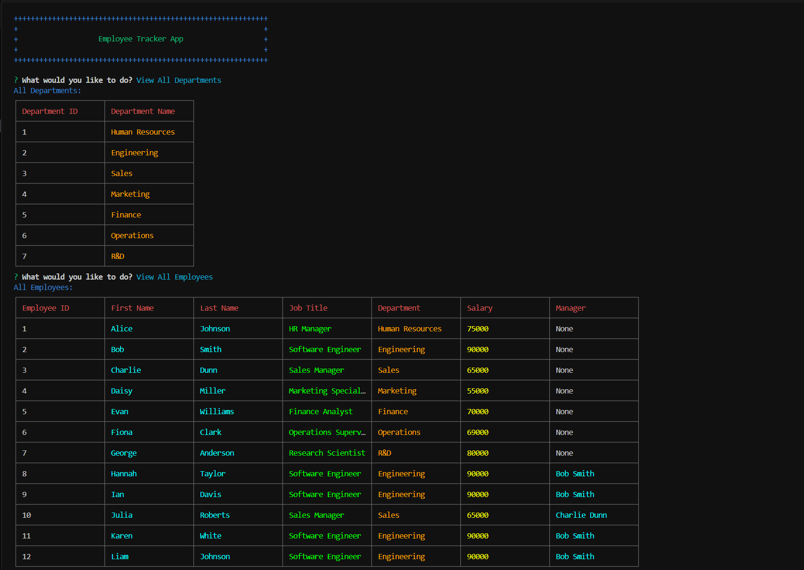

# Employee Tracker Database using CMS

_A full-stack CLI application for managing employees, departments, and roles using PostgreSQL and Node.js._


---

## Description

**Employee Tracker Database using CMS** is a command-line application that allows you to manage employees, departments, and roles in a PostgreSQL database. It provides a simple CLI for viewing, adding, updating, and deleting records, as well as viewing department budgets.

---

## Table of Contents

- [Employee Tracker Database using CMS](#employee-tracker-database-using-cms)
  - [Description](#description)
  - [Table of Contents](#table-of-contents)
  - [Features](#features)
  - [Media](#media)
    - [Screenshot](#screenshot)
    - [Video Demo](#video-demo)
  - [Prerequisites](#prerequisites)
  - [Technologies Used](#technologies-used)
  - [Quick Start](#quick-start)
  - [Installation](#installation)
  - [Usage](#usage)
  - [Troubleshooting](#troubleshooting)
  - [Notes](#notes)
  - [Contributing, Support, and FAQ](#contributing-support-and-faq)
  - [Acknowledgments](#acknowledgments)
  - [License](#license)
  - [Author](#author)

---

## Features

- **View all departments, roles, and employees**
- **Add a department, role, or employee**
- **Update employee roles and managers**
- **Delete departments, roles, or employees**
- **View total utilized budget of a department**
- **View employees by department or manager**
- **Search for employees by name**
- **Calculate department budgets directly from the CLI**
- **Interactive prompts for all actions**
- **Clear tabular output for all queries**

---

## Media

### Screenshot



### Video Demo

[Checkout the application in use](https://drive.google.com/file/d/1NT2wX6xkN-Jq-wIeR9K-pQviQRZ17PaW/view?usp=sharing)

---

## Prerequisites

- [Node.js](https://nodejs.org/) (v16 or higher)
- [npm](https://www.npmjs.com/)
- [PostgreSQL](https://www.postgresql.org/)

---

## Technologies Used

- [Node.js](https://nodejs.org/)
- [TypeScript](https://www.typescriptlang.org/)
- [PostgreSQL](https://www.postgresql.org/)
- [pg](https://node-postgres.com/)
- [inquirer](https://www.npmjs.com/package/inquirer)
- [chalk](https://www.npmjs.com/package/chalk)
- [cli-table3](https://www.npmjs.com/package/cli-table3)
- [dotenv](https://www.npmjs.com/package/dotenv)

---

## Quick Start

> You can get the code by either cloning this repository using Git, or downloading it as a ZIP file from GitHub (click the green "Code" button, then "Download ZIP").
> On GitHub, you can also browse the code, view commit history, open issues, and submit pull requests.

---

## Installation

1. **Clone the repository:**
    ```sh
    git clone <repository-url>
    cd employee-tracker-database-using-cms
    ```

2. **Install dependencies:**
    ```sh
    npm install
    ```

3. **Create a `.env` file in the root directory and add your database configuration:**
    ```env
    DB_USER=your_db_user
    DB_HOST=your_db_host
    DB_DATABASE=your_db_name
    DB_PASSWORD=your_db_password
    DB_PORT=5432
    ```
    > **Note:** Never commit your real `.env` file to version control. Only commit `.env.example` with placeholder values.

4. **Set up the database:**
    ```sh
    psql -U your_db_user -f db/schema.sql
    psql -U your_db_user -f db/seed.sql
    ```

---

## Usage

1. **Build the project:**
    ```sh
    npm run build
    ```

2. **Start the application:**
    ```sh
    npm start
    ```

3. **Follow the CLI prompts to manage your employee data.**

---

## Troubleshooting

If you encounter issues running the application, try the following:

- **Database connection errors:**
  - Double-check your `.env` file values for typos or missing fields.
  - Ensure PostgreSQL is running and accessible on the specified host and port.
  - Confirm your database user has the correct permissions.
- **Missing module errors:**
  - Run `npm install` to ensure all dependencies are installed.
- **Database not seeded or missing tables:**
  - Run the schema and seed scripts again:
    ```sh
    psql -U your_db_user -f db/schema.sql
    psql -U your_db_user -f db/seed.sql
    ```
- **Permission denied or command not found:**
  - Make sure you have the necessary permissions to run scripts and access the database.
  - On Windows, ensure `psql` is in your system PATH.
- **Other issues:**
  - Check the Issues section on GitHub for similar problems or open a new issue with details.

---

## Notes

- The codebase is commented for clarity and future reference.
- The CLI is interactive and user-friendly for quick management tasks.

---

## Contributing, Support, and FAQ

- **Contributions:**
  Pull requests are welcome! Please open an issue or submit a pull request for improvements or bug fixes. Make sure your code is well-documented and tested.
- **Support:**
  If you encounter any issues or have suggestions, please open an issue on GitHub. You can also reach out via [GitHub Discussions](https://github.com/heimsharon/employee-tracker-database-using-cms/discussions) if enabled.
- **FAQ:**
    - _How do I run the program?_
      See the [Installation](#installation) and [Usage](#usage) sections above.
    - _Can I use this for my own project?_
      Yes, this project is MIT licensed. See the [License](#license) section.
    - _I'm having trouble connecting to the database or running the app!_
      See the [Troubleshooting](#troubleshooting) section above for common solutions.
    - _How do I reset the database?_
      Re-run the seed command:
      ```sh
      psql -U your_db_user -f db/seed.sql
      ```
    - _Where can I ask questions or suggest features?_
      Please use the Issues or Discussions section on GitHub.

---

## Acknowledgments

Portions of this project were developed using starter code provided by [edX Boot Camps LLC](https://bootcamp.edx.org/) for educational purposes.

---

## License

This project is licensed under the [MIT License](./LICENSE.txt).

See the [MIT License text](https://opensource.org/licenses/MIT) for full details.

---

## Author

Created by Sharon Heim.
For questions or suggestions, please visit my [GitHub profile](https://github.com/heimsharon).

---

© 2025 Employee Tracker Database Project